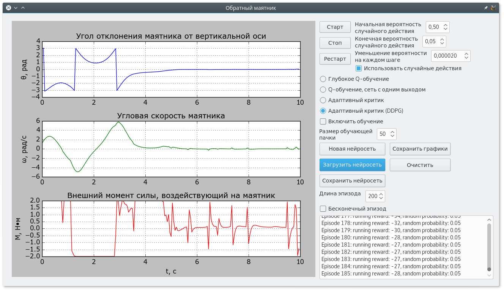

# Управление перевёрнутым маятником

Программа создана для исследования алгоритмов обучения с подкреплением на примере перевёрнутого маятника **Pendulum-v0** из пакета **[OpenAI Gym](https://github.com/openai/gym)**. Написана на языке **Python 3**, нейронные сети реализованы с помощью пакетов **TensorFlow** и **Keras**. Для удобства исследования, настройки параметров и отображения графиков движения маятника был создан графический интерфейс с помощью **PyQt 5**.  

## Используемые модели обучения:  

- **Deep Q-learning**. Используется одна нейронная сеть, реализованная с помощью пакета **Keras**. Сеть имеет число входов, соответствующее числу координат вектора параметров состояния маятника (три). Число выходов сети соответствует количеству доступных действий. В данном случае - их два (максимальный внешний момент влево и максимальный внешний момент вправо).   

- **Q-learning с нейронной сетью с одним выходом**. Используется одна нейронная сеть, реализованная с помощью пакета **Keras**. Сеть имеет число входов, соответствующее сумме числа координат вектора параметров состояния маятника и числа координат вектора параметров действия (в сумме четыре). Сеть имеет один выход, с которого снимается предсказание полезности поданного на вход действия в поданном на вход состоянии.  

- **Deep deterministic policy gradient (DDPG)** (Actor-critic). Используются две нейронные сети: актор и критик. Эти сети и метод их совместного обучения реализован с помощью пакета **TensorFlow**. Сеть-актор получает на вход вектор параметров состояния и предсказывает вектор параметров наилучшего действия в данном состоянии. Сеть-критик получает на вход также вектор параметров состояния и вектор параметров действия с выхода актора. Эта сеть предсказывает полезность действия, предлагаемого актором в данном состоянии. 

## Требования:  

- **Python 3**.  

Пакеты:  

- **gym**.  
- **keras**;  
- **tensorflow**;  
- **PyQt5**;  
- **matplotlib**;  
- **numpy**.  

Все пакеты можно установить при помощи *pip*.  
## Запуск: 
```
python main.py
```  
или  
```
python3 main.py
```  
В папке *Nets* сохранены обученные нейронные сети для каждого из трёх алгоритмов.  

    
    
  
Барашков А.А., 2017 - 2018 
